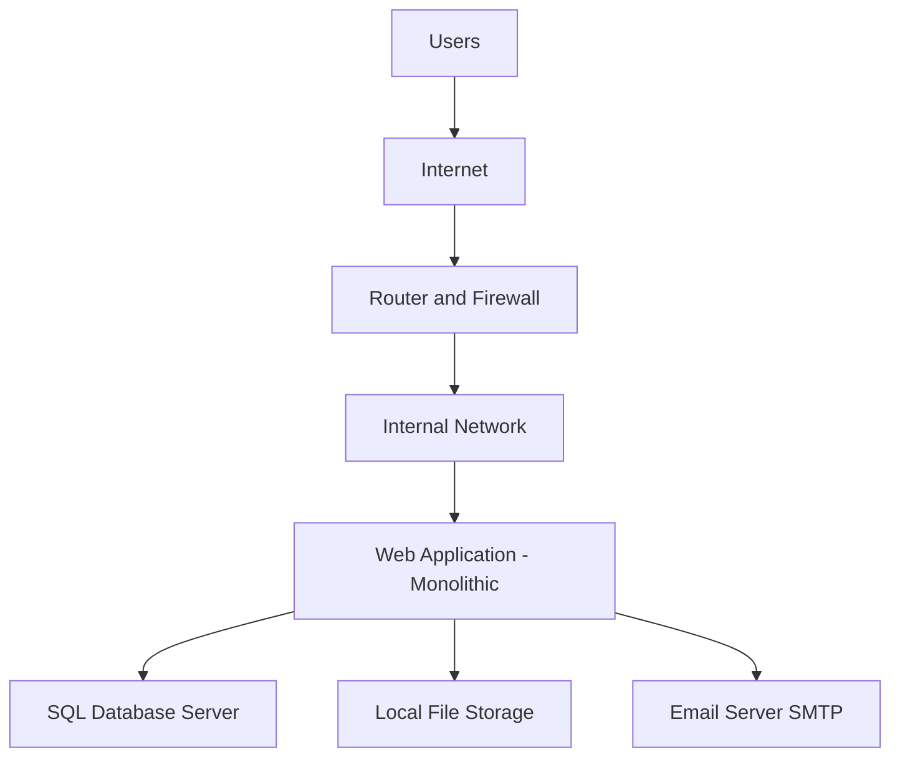

   ### current on-premises architecture
The current system is based on a traditional on-premises architecture, where all application components are hosted and managed within the company’s own data center. The organization is fully responsible for hardware, software, networking, security, and maintenance.

The web application follows a monolithic architecture and is deployed on a physical server. This single application handles the user interface, business logic, and server-side processing. Users access the application over the internet, and all requests pass through the company’s router and firewall before reaching the internal network.

The backend database is hosted on a dedicated on-premises SQL server. It stores critical business data such as customer information, product details, orders, and transaction records. The web application communicates directly with the database server over the internal network.

File storage is implemented using a local file system hosted on a physical storage server. The web application depends on this file system to store and retrieve files such as product images, documents, and reports. Storage capacity is limited by physical hardware and requires manual expansion.

Networking is managed using company-owned routers, switches, and firewalls. These components control internet access, internal communication, and basic security policies. All traffic between users and backend systems flows through this network infrastructure.

The system also includes an on-premises email server used for client notifications such as order confirmations and password reset emails. This server must be maintained, monitored, and secured by the internal IT team.

Overall, the current on-premises design is tightly coupled and hardware-dependent, leading to higher operational overhead, limited scalability, and increased maintenance effort.

