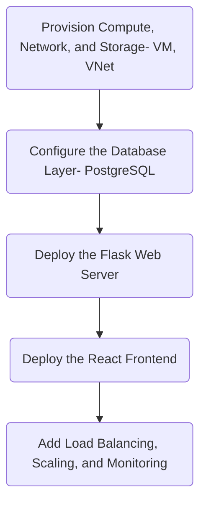
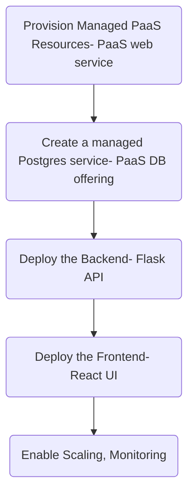

### Q1
The application can be deployed in the cloud using IaaS by first provisioning the required compute, network, and storage resources, including virtual machines (VMs) and a virtual network (VNet) to securely connect all components. Next, the database layer is configured by installing and setting up PostgreSQL on a dedicated VM with persistent storage. The Flask web server is then deployed on a separate VM to handle backend logic and API requests, with appropriate security and network access controls. After that, the React frontend is deployed on another VM and configured to communicate with the Flask backend over the VNet. Finally, load balancing, auto-scaling, and monitoring are added to ensure high availability, performance, and reliability of the application in the cloud environment.

### Q2
The application deployment begins by provisioning managed PaaS resources, including a PaaS web service to host the application components. A managed Postgres database is then created using the cloud provider’s PaaS database offering, which handles backups, availability, and maintenance. Next, the backend Flask API is deployed to the PaaS web service and configured to connect securely to the managed Postgres database. After that, the React UI frontend is deployed to a PaaS hosting service, where it serves static content and communicates with the Flask API. Finally, scaling and monitoring are enabled to ensure high availability, performance optimization, and visibility into application health and resource usage.

### Q3
### IaaS 

### PaaS

